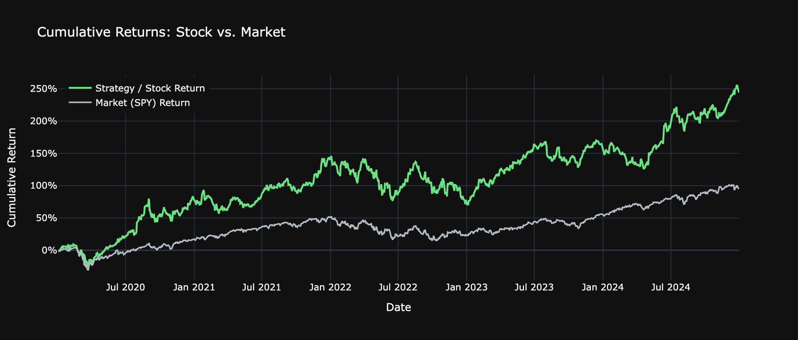
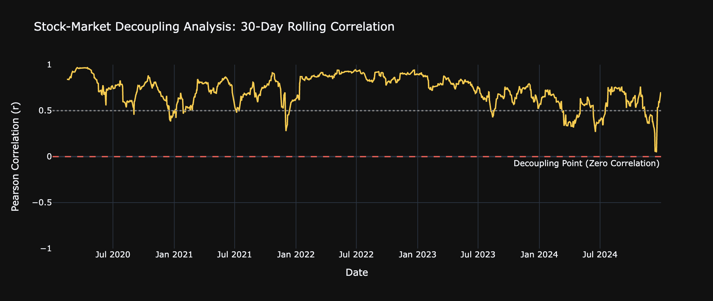
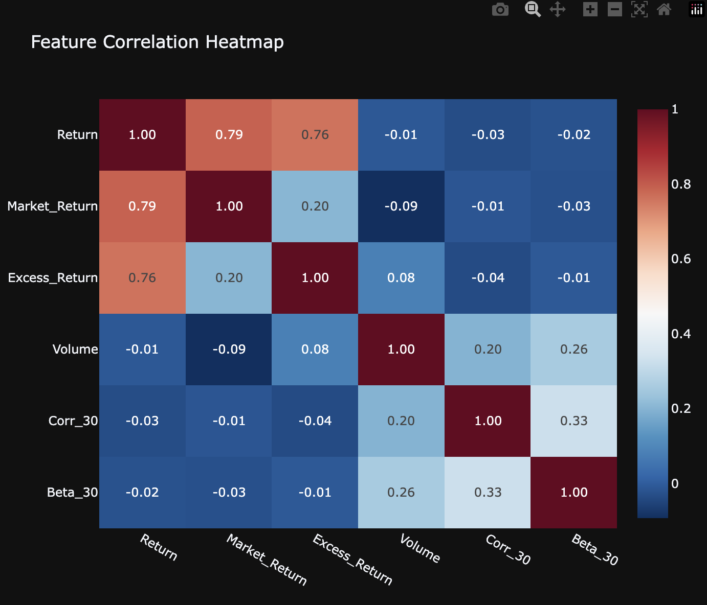
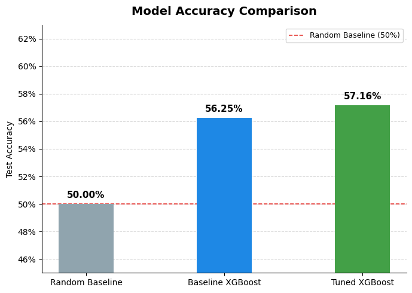
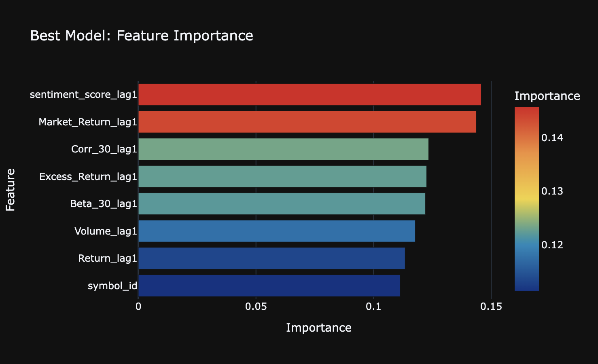
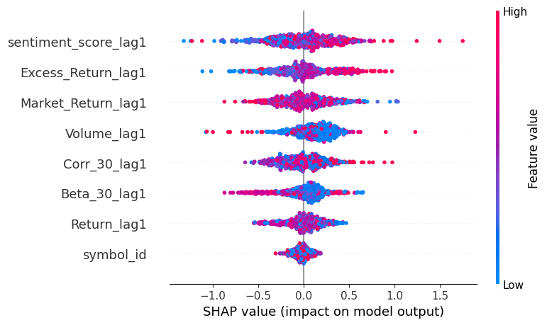
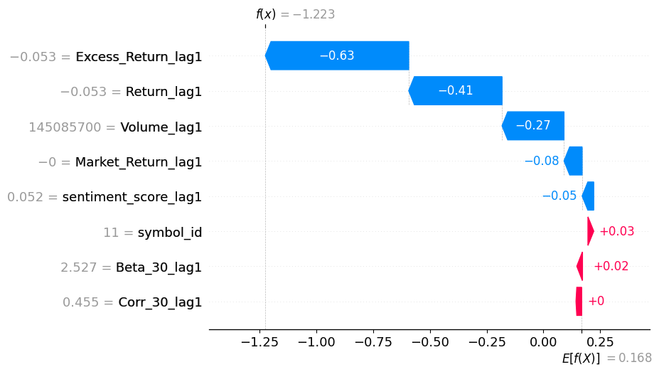

# Stock Price Prediction & Trading Strategy
## CS506 — Boston University
>  Video Walkthrough: https://youtu.be/EZlN0NlRfQs

## Setup & How to Run
To make our project easier to reproduce, we used a Makefile to organize the main commands. This allows users to set up the environment, run the data pipeline, execute notebooks, and clean generated files with simple commands.

The project requires Python 3.10 or later, and all dependencies are listed in requirements.txt.
Users only need to run “make run” to execute the full main project pipeline.

Main commands:
1. `make install`: creates the virtual environment and installs dependencies.
2. `make download`: downloads historical stock and ETF data using yfinance.
3. `make clean-data`: cleans the raw data and generates financial features.
4. `make prepare`: fetches news, runs FinBERT sentiment analysis, and builds the master feature dataset. Results are cached to `data/sentiment_cache/` and `data/master/`, so this step is skipped automatically on subsequent runs.
5. `make notebooks`: executes the project notebooks and saves the executed versions.
6. `make run`: runs the full pipeline (install → download → clean-data → prepare → notebooks).
7. `make test`: runs the test suite using pytest.
8. `make clean`: removes generated files, including the virtual environment, raw data, cleaned data, and executed notebooks.

After running the pipeline, the raw data is stored in `data/raw/`, the cleaned data is stored in `data/clean/`, sentiment cache and the master dataset are stored in `data/sentiment_cache/` and `data/master/`, and the executed notebooks are saved in the `src/` directory.

> **Note:** `make prepare` runs FinBERT in a separate process (`src/prepare_data.py`) before the model notebook. This prevents the FinBERT model from occupying memory during XGBoost training, which can cause kernel crashes on machines with limited RAM.

## Project Overview

This project aims to predict the next-day stock price direction, classifying whether a stock will go up or down. We use historical OHLCV stock data, market and sector information, and news sentiment features to build a machine learning prediction pipeline.

Our dataset includes 14 major U.S. stocks across different sectors, combined with market benchmark data and FinBERT-based sentiment scores. The best tuned XGBoost model achieved 57.16% accuracy, which is higher than the 50% random baseline.

Overall, the result suggests that combining financial indicators with sentiment information can provide useful signals for short-term stock movement prediction, although the task remains challenging due to market noise.

## Data

### Data Sources

This project integrates multiple data sources to construct a comprehensive dataset for stock price prediction.

- **Stock & Market data:** Yahoo Finance (yfinance) — historical daily OHLCV (Open, High, Low, Close, Volume) data for 14 stocks and ETF benchmarks, covering 2015-01-01 to 2025-01-01.
- **News data:** Finnhub API — financial news headlines and summaries for each stock.
- **Sentiment model:** FinBERT (ProsusAI/finbert) — transformer-based model for computing sentiment scores from news text.

### Directory Structure

```
data/
  raw/
  clean/
  news/
  sentiment_cache/
  master/
```

### Data Pipeline

**Step A: Data Download (`src/data_download.py`)**

Stock and ETF data are downloaded via `yf.download()` at daily frequency. Each ticker is saved as an individual CSV file under `data/raw/`. Assets covered:

| Sector | Stocks | Sector ETF |
|---|---|---|
| Technology | AAPL, MSFT, GOOG, NVDA | XLK |
| Financial | JPM, BAC, GS | XLF |
| Healthcare | JNJ, PFE, UNH | XLV |
| Energy | XOM, CVX | XLE |
| Consumer | AMZN, TSLA, HD | XLY |
| Market Benchmark | SPY, QQQ | — |

**Step B: Feature Engineering (`src/data_clean.py`)**

Raw price data is transformed into economically meaningful indicators. The pipeline merges stock data with SPY and sector ETF data, then computes all relative features. Final output is saved under `data/clean/`.

- **Daily Return & Excess Return:** Daily return is the percentage change in closing price. Excess return is defined as stock return minus the market return (SPY) and also relative to the corresponding sector ETF. The chart below (AAPL as example) shows that individual stocks can diverge substantially from the market over time, motivating the use of excess return as a feature.



- **Rolling Correlation (30-day):** 30-day rolling correlation between the stock return and market/sector return, capturing dynamic co-movement patterns over time. The correlation is not constant — it dips sharply during periods of idiosyncratic events (e.g., early 2022, late 2024), which is why a rolling rather than static measure is used.



- **Rolling Beta (30-day):** Computed as rolling covariance between the stock and benchmark divided by benchmark variance, measuring systematic risk and sensitivity to market/sector movements.

The heatmap below confirms that the return-based features (Return, Market_Return, Excess_Return) are largely independent of the rolling statistics (Corr_30, Beta_30) and volume, supporting the use of all feature groups together without high multicollinearity.



**Step C: Sentiment Integration (`src/prepare_data.py`)**

News for each stock is fetched from Finnhub, then processed by FinBERT to produce a sentiment score per article. Scores are aggregated daily (mean) and lagged by one trading day to form the `sentiment_score_lag1` feature used in modeling. This step runs as a standalone script (`make prepare`) so that FinBERT is fully unloaded from memory before model training begins.

### Final Dataset

The master dataset (`Final_Mega_Dataset.csv`) combines all features across 14 stocks:

- **Price features:** Open, close, high, low prices, daily return, and trading volume — capturing short-term price dynamics and momentum.
- **Market features:** SPY return, excess return vs. market, 30-day rolling correlation and beta with SPY — reflecting a stock's sensitivity to broad market movements.
- **Sector features:** Sector ETF return, excess return vs. sector, 30-day rolling correlation and beta with sector ETF — capturing industry-specific effects and macroeconomic exposure.
- **Sentiment features:** FinBERT-based sentiment score aggregated from daily news, lagged by one trading day.

## Modeling Approach

### Model

#### XGBoost binary classifier

XGBoost Binary Classifier is an implementation of the Gradient Boosted Decision Tree algorithm designed for binary classification tasks. It works by sequentially building an ensemble of decision trees where each new tree attempts to correct the residual errors made by the previous trees.

### Train/Test Split

We do 80/20 **chronological splitting** to the dataset. We cannot shuffle all the data and split it into two parts because stock prices are not independent and identically distributed. Today's price is heavily influenced by yesterday's price. If shuffling the data randomly, the model might peek into the future to predict the past.
### Features Used
The model utilizes three primary categories of features to predict stock price direction. All features are **lagged by one trading day** to ensure the model only uses historically available information to predict the next day's movement.
#### **NLP Sentiment Features**
- **sentiment_score_lag1**: The average sentiment score derived from news headlines and summaries using the **FinBERT** model, lagged by one day.
#### **Market & Technical Indicators**
- **Return_lag1**: The stock's return from the previous trading day.

- **Volume_lag1**: Trading volume from the previous day.
- **Market_Return_lag1**: The overall market return from the previous day.
- **Excess_Return_lag1**: The stock's return relative to the market return from the previous day.
- **Beta_30_lag1**: The 30-day rolling beta, indicating volatility relative to the market.
- **Corr_30_lag1**: The 30-day rolling correlation between the stock and the market.
#### **Categorical Entity Features**
- **symbol_id**: A numerical identifier for each of the 14 processed stocks, generated via LabelEncoder.
#### **Target Variable**
- **label**: A binary classification where 1 indicates a positive stock return (x>0) and 0 indicates otherwise.

### Hyperparameter Tuning
To enhance performance, we conducted hyperparameter tuning using Grid Search combined with TimeSeriesSplit. This specific cross-validation technique is crucial for financial forecasting to prevent look-ahead bias. By optimizing parameters such as the learning rate and the number of estimators, we improved our cross-validation accuracy to 56.42%.

**Best Parameters:**

```
max_depth=6
learning_rate=0.05
n_estimators=300
subsample=0.9
colsample_bytree=0.9
```

## Results

### Model Accuracy

Both models outperform the 50% random baseline. Hyperparameter tuning via GridSearchCV with TimeSeriesSplit yields a modest but consistent improvement.

| Model | Test Accuracy | Macro Precision | Macro Recall | Macro F1 |
|---|---|---|---|---|
| Random Baseline | 50.00% | ~0.50 | ~0.50 | ~0.50 |
| Baseline XGBoost | 56.25% | 0.56 | 0.56 | 0.55 |
| Tuned XGBoost | 57.16% | 0.57 | 0.57 | 0.56 |
| Best CV (Tuned) | 58.36% | — | — | — |



Both XGBoost models show notably higher recall for the "price up" class (label = 1) than for "price down" (label = 0). After tuning, recall on the positive class improves from 0.66 to 0.70, while recall on the negative class drops slightly from 0.45 to 0.43, suggesting the model is better at identifying upward movements. Overall accuracy and F1 improve marginally with tuning.

### Feature Importance

XGBoost's built-in importance ranks `sentiment_score_lag1` and `Market_Return_lag1` as the two most influential features, each contributing roughly 15% of the total split gain. The remaining features (`Corr_30_lag1`, `Excess_Return_lag1`, `Beta_30_lag1`, `Volume_lag1`, `Return_lag1`, `symbol_id`) are distributed fairly evenly in the 11–13% range, indicating no single market indicator dominates on its own.



### SHAP Analysis

The SHAP beeswarm plot reveals the direction and magnitude of each feature's impact across all test samples. `sentiment_score_lag1` has the widest horizontal spread, confirming it is the most impactful feature — high sentiment scores (red dots) push predictions strongly toward "price up", while low scores (blue dots) push toward "price down". `Excess_Return_lag1` and `Market_Return_lag1` show a similar directional pattern but with tighter distributions.



The waterfall plot below breaks down a single prediction: for this sample, `Excess_Return_lag1` (−0.63) and `Return_lag1` (−0.41) are the dominant forces pushing the model toward "price down", while `sentiment_score_lag1` offers a small positive counter-signal (+0.05). The final output f(x) = −1.223 sits well below the base value of 0.168, resulting in a "price down" prediction.



### Key Findings

Sentiment is the most important single feature by both XGBoost split gain and SHAP spread, validating the hypothesis that news sentiment carries short-term predictive signal beyond price-based indicators. However, the overall accuracy of 57.16%, while meaningfully above the 50% random baseline, reflects the fundamental difficulty of next-day direction forecasting in noisy financial markets. The model is not overfit: test accuracy (57.16%) is close to the cross-validation score (56.42%), and the gap between baseline and tuned models is small, suggesting the data volume and feature set are the primary limiting factors rather than model configuration.

## Tests & CI

This project includes a small set of tests to check the most important parts of the data processing pipeline. The tests are written with pytest and focus on the preprocessing functions instead of the full machine learning model.

The tests check:
1. `load_and_clean()`: verifies that raw CSV files can be loaded and cleaned correctly.
2. Return: checks that the daily return column is created correctly.
3. `add_features()`: verifies that market and sector features are generated.

Important generated features include `Excess_Return`, `Corr_30`, `Beta_30`, `Excess_Return_sector`, `Corr_30_sector`, and `Beta_30_sector`.

We also use GitHub Actions for continuous integration. When code is pushed to GitHub or a pull request is opened, the workflow automatically sets up Python, installs dependencies, and runs pytest.

## Team

| Name      | UID |Email           |
| --------- |----| --------------- |
|Liang Yu Lin| U55834159|lin0326@bu.edu|
| Ruoxi Cao | U76452880|ruoxicao@bu.edu |
|Ying Huang |U13787608 |yinghy@bu.edu|
|Xiju Jiang |u03732023 |jsquared@bu.edu|


